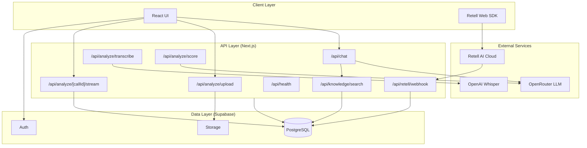
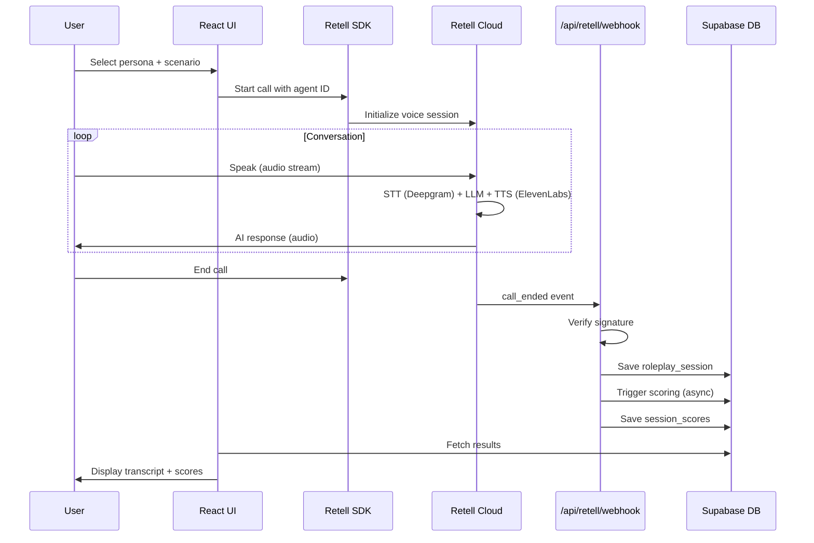
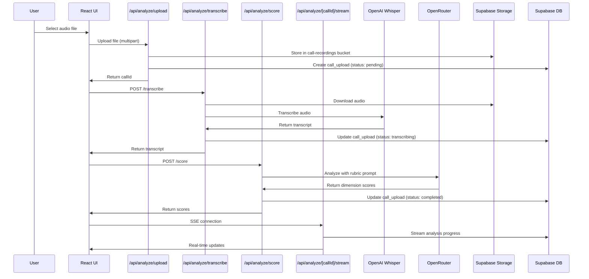
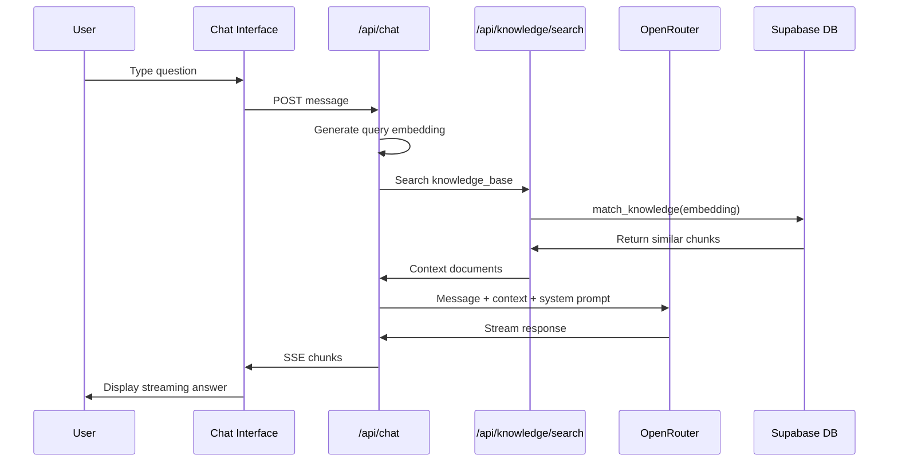

# Underdog AI Sales Coach - Architecture Documentation

## System Overview

The Underdog AI Sales Coach is an AI-powered sales training platform implementing the Underdog Sales methodology. It provides three core learning modes:

1. **Voice Practice** - Realistic roleplay conversations with AI personas
2. **Call Analysis** - Upload and score real sales call recordings
3. **Chat Coaching** - RAG-powered coaching assistant for methodology questions

### Core Value Proposition

Salespeople can practice and improve through realistic AI conversations with immediate feedback, without the pressure of training with real prospects or the expense of human coaches.

### Tech Stack

| Layer | Technology |
|-------|------------|
| Frontend | Next.js 16.1.2, React 19, TypeScript |
| Backend | Next.js API Routes (App Router) |
| Database | Supabase (PostgreSQL + Auth + Storage) |
| Voice AI | Retell AI (ElevenLabs TTS + Deepgram STT) |
| LLM | OpenAI GPT-4o via OpenRouter |
| Embeddings | OpenAI text-embedding-3-small |
| Monitoring | Sentry (error tracking + session replay) |
| Deployment | Vercel |

## Architecture Diagram

## Component Responsibilities

### `/src/app/`

Page routes and API handlers following Next.js App Router conventions.

| Directory | Purpose |
|-----------|---------|
| `(auth)/` | Login and signup pages with Supabase Auth |
| `(dashboard)/` | User dashboard with history and progress tabs |
| `(practice)/` | Voice practice interface with persona selection |
| `(analyze)/` | Call upload and analysis results pages |
| `admin/` | Admin dashboard for user management and analytics |
| `api/` | API route handlers for all backend logic |

### `/src/components/`

React components organized by feature domain.

| Directory | Purpose |
|-----------|---------|
| `dashboard/` | HistoryPanel, ProgressPanel, ScoreTrend charts |
| `practice/` | VoicePractice, PersonaSelector, ScenarioCards |
| `analyze/` | UploadForm, TranscriptViewer, ScoreDisplay |
| `admin/` | UsersTable, MetricsCards, UsageCharts |
| `ui/` | Shared primitives (Button, Card, Input, etc.) |

### `/src/config/`

Static configuration for AI behavior and curriculum.

| File | Purpose |
|------|---------|
| `personas.ts` | AI persona definitions (name, voice, personality, prompts) |
| `rubric.ts` | 6-dimension scoring rubric with criteria |
| `curriculum.ts` | 12-module curriculum structure and topics |
| `coach.ts` | Chat coaching system prompts and behavior |

### `/src/lib/`

Utility libraries and service integrations.

| File | Purpose |
|------|---------|
| `supabase/client.ts` | Browser Supabase client |
| `supabase/server.ts` | Server-side Supabase client with service role |
| `supabase/types.ts` | Generated TypeScript types from database |
| `retell/client.ts` | Retell SDK initialization and helpers |
| `knowledge.ts` | RAG search with pgvector embeddings |
| `logger.ts` | Structured logging utility |
| `circuit-breaker.ts` | Fault tolerance for external services |

## Key Data Flows

### 1. Voice Practice Flow

User conducts a roleplay conversation with an AI sales prospect.

### 2. Call Analysis Flow

User uploads a real sales call recording for AI analysis.

### 3. Chat Coaching Flow

User asks a question about sales methodology.

## Technology Decisions

### Why Retell AI

| Decision Factor | Rationale |
|-----------------|-----------|
| Managed infrastructure | No need to run WebRTC servers, handle audio codecs, or manage voice model latencies |
| Voice quality | ElevenLabs integration provides natural-sounding AI voices |
| Low latency | Real-time conversation with <400ms response time |
| Better interruption handling | Natural conversation flow with improved turn-taking |
| Cost efficiency | ~40-50% lower cost compared to alternatives |
| SDK simplicity | `retell-client-js-sdk` handles all browser audio complexity |

### Why OpenRouter

| Decision Factor | Rationale |
|-----------------|-----------|
| Multi-model access | Switch between GPT-4o, Claude, Gemini without code changes |
| Cost control | Per-request billing, no reserved capacity |
| Fallback routing | Automatic failover if primary model is unavailable |
| Unified API | OpenAI-compatible interface for all models |

### Why Supabase

| Decision Factor | Rationale |
|-----------------|-----------|
| Auth + DB + Storage | Single platform for all data needs |
| Row Level Security | Database-level access control without middleware |
| PostgreSQL | Full SQL power with pgvector extension for embeddings |
| Real-time | WebSocket subscriptions for live updates |
| Edge Functions | Serverless compute close to data |

### Why pgvector

| Decision Factor | Rationale |
|-----------------|-----------|
| Native PostgreSQL | No separate vector database to manage |
| Cosine similarity | `<=>` operator for semantic search |
| IVFFlat indexing | Fast approximate nearest neighbor search |
| Supabase support | Built-in extension, works with RLS |
| 1536 dimensions | Matches OpenAI text-embedding-3-small output |

## Security Architecture

### Authentication

- **Provider**: Supabase Auth with magic link and OAuth
- **Session**: JWT tokens stored in HTTP-only cookies
- **Refresh**: Automatic token refresh via Supabase client

### Authorization

- **RLS Policies**: All tables have Row Level Security enabled
- **User isolation**: Users can only access their own data
- **Admin access**: Role-based access for organization admins
- **Service role**: Backend uses service role key for cross-user operations

### API Security

- **Retell Webhooks**: Signature verification for call events
- **Rate limiting**: Built into Vercel and Supabase
- **CSP Headers**: Content Security Policy configured in `next.config.ts`
- **Audit logging**: All sensitive operations logged to `audit_log` table

## Observability

### Error Tracking

- **Sentry** captures errors from client, server, and edge runtimes
- Session replay records user interactions before errors
- Source maps uploaded for readable stack traces

### Logging

- Structured JSON logging via `src/lib/logger.ts`
- Log levels: debug, info, warn, error
- Request IDs for tracing across services

### Health Checks

- `/api/health` endpoint checks:
  - Supabase database connectivity
  - OpenAI API availability
  - OpenRouter API availability
- Used by Vercel and external monitoring

### Circuit Breaker

- `src/lib/circuit-breaker.ts` protects against cascading failures
- Opens after 5 consecutive failures
- Half-open state tests recovery after 30 seconds

## Related Documentation

- [DATABASE.md](./DATABASE.md) - Complete database schema and RLS policies
- [CLAUDE.md](../CLAUDE.md) - Developer quick reference
- [PRIVACY_POLICY.md](./PRIVACY_POLICY.md) - Data handling practices
- [DATA_RETENTION_POLICY.md](./DATA_RETENTION_POLICY.md) - Data lifecycle management
