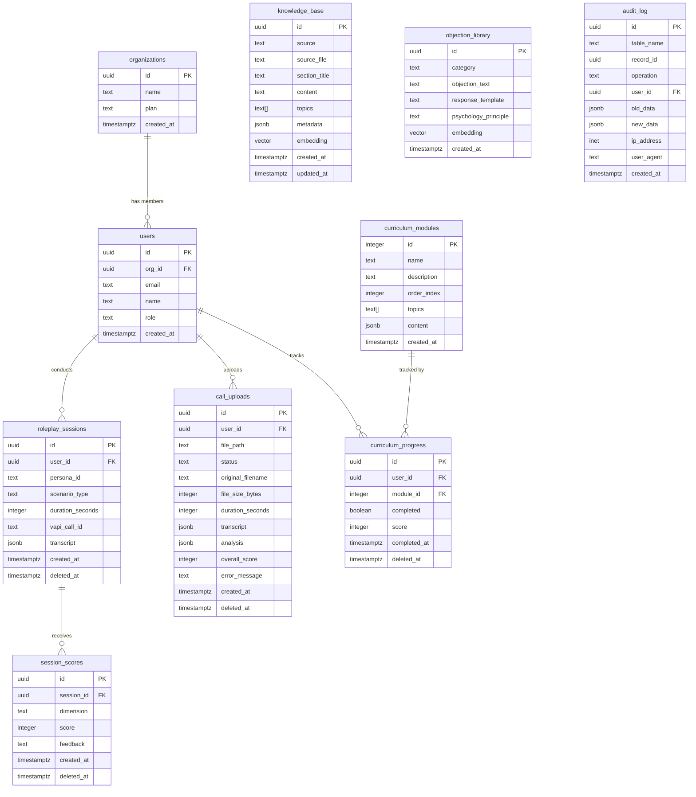

# Underdog AI Sales Coach - Database Documentation

## Overview

| Attribute | Value |
|-----------|-------|
| Database | PostgreSQL 15 via Supabase |
| Extensions | pgvector (vector similarity search) |
| Auth | Supabase Auth (synced to public.users) |
| Storage | Supabase Storage (call-recordings bucket) |
| Security | Row Level Security (RLS) on all tables |

### Soft Delete Pattern

User-facing tables use a `deleted_at` column for soft deletion. Records with `deleted_at IS NOT NULL` are excluded from queries via RLS policies. This enables:

- Data retention for compliance
- Recovery of accidentally deleted data
- Audit trail preservation

Tables with soft delete: `roleplay_sessions`, `session_scores`, `call_uploads`, `curriculum_progress`

## Schema Diagram



## Tables

### organizations

Organizations for multi-tenant support.

| Column | Type | Nullable | Description |
|--------|------|----------|-------------|
| id | uuid | No | Primary key, auto-generated |
| name | text | No | Organization display name |
| plan | text | Yes | Subscription tier: 'free', 'pro', 'enterprise' |
| created_at | timestamptz | Yes | Creation timestamp, defaults to NOW() |

**RLS Policies:**
- Users can view their own organization data via org_id relationship

---

### users

Application users, synced from auth.users via trigger.

| Column | Type | Nullable | Description |
|--------|------|----------|-------------|
| id | uuid | No | Primary key, matches auth.users.id |
| org_id | uuid | Yes | Foreign key to organizations |
| email | text | No | User email, unique |
| name | text | No | Display name |
| role | text | Yes | 'admin' or 'user', defaults to 'user' |
| created_at | timestamptz | Yes | Creation timestamp |

**RLS Policies:**
- `Users can view their own data`: SELECT where auth.uid() = id
- `Users can update their own data`: UPDATE where auth.uid() = id
- `Admins can view org users`: SELECT for org_id match where viewer is admin

**Triggers:**
- `on_auth_user_created`: Syncs new auth.users to public.users

---

### roleplay_sessions

Voice practice session records with transcripts.

| Column | Type | Nullable | Description |
|--------|------|----------|-------------|
| id | uuid | No | Primary key |
| user_id | uuid | No | Foreign key to users (cascade delete) |
| persona_id | text | No | AI persona identifier from config |
| scenario_type | text | No | 'cold_call', 'objection', 'closing', 'gatekeeper' |
| duration_seconds | integer | Yes | Call duration in seconds |
| vapi_call_id | text | Yes | VAPI call ID for debugging |
| transcript | jsonb | Yes | Full conversation transcript |
| created_at | timestamptz | Yes | Session start timestamp |
| deleted_at | timestamptz | Yes | Soft delete timestamp |

**RLS Policies:**
- `Users can view sessions`: SELECT own sessions OR org sessions (for admins) OR all (for admins)
- `Users can insert their own sessions`: INSERT where auth.uid() = user_id

**Indexes:**
- `idx_roleplay_sessions_user_id`: Fast user filtering
- `idx_roleplay_sessions_created_at`: Sorted history queries
- `idx_roleplay_sessions_deleted`: Partial index for active records

---

### session_scores

Per-dimension scoring for roleplay sessions.

| Column | Type | Nullable | Description |
|--------|------|----------|-------------|
| id | uuid | No | Primary key |
| session_id | uuid | No | Foreign key to roleplay_sessions (cascade) |
| dimension | text | No | 'opener', 'pitch', 'discovery', 'objection_handling', 'closing', 'communication' |
| score | integer | No | 1-10 score |
| feedback | text | Yes | AI-generated feedback text |
| created_at | timestamptz | Yes | Score timestamp |
| deleted_at | timestamptz | Yes | Soft delete timestamp |

**RLS Policies:**
- `Users can view their session scores`: SELECT via session ownership check
- `Users can insert scores for their sessions`: INSERT via session ownership check

**Indexes:**
- `idx_session_scores_session_id`: Fast join to sessions
- `idx_session_scores_deleted`: Partial index for active records

---

### call_uploads

Uploaded call recordings for analysis.

| Column | Type | Nullable | Description |
|--------|------|----------|-------------|
| id | uuid | No | Primary key |
| user_id | uuid | No | Foreign key to users (cascade delete) |
| file_path | text | No | Path in storage bucket |
| original_filename | text | Yes | User's original file name |
| status | text | Yes | 'pending', 'transcribing', 'scoring', 'completed', 'failed' |
| file_size_bytes | integer | Yes | File size for quota tracking |
| duration_seconds | integer | Yes | Audio duration |
| transcript | jsonb | Yes | Whisper transcription result |
| analysis | jsonb | Yes | Full analysis with scores and feedback |
| overall_score | integer | Yes | Aggregate score 1-10 |
| error_message | text | Yes | Error details if status='failed' |
| created_at | timestamptz | Yes | Upload timestamp |
| deleted_at | timestamptz | Yes | Soft delete timestamp |

**RLS Policies:**
- `Users can view uploads`: SELECT own uploads OR all (for admins)
- `Users can insert their own uploads`: INSERT where auth.uid() = user_id
- `Users can update their own uploads`: UPDATE where auth.uid() = user_id

**Indexes:**
- `idx_call_uploads_user_id`: Fast user filtering
- `idx_call_uploads_status`: Status filtering
- `idx_call_uploads_user_status`: Combined user+status queries
- `idx_call_uploads_deleted`: Partial index for active records

---

### curriculum_modules

Static curriculum content (12 modules).

| Column | Type | Nullable | Description |
|--------|------|----------|-------------|
| id | integer | No | Primary key (1-12) |
| name | text | No | Module title |
| description | text | Yes | Module summary |
| order_index | integer | No | Display order |
| topics | text[] | Yes | Topic tags for filtering |
| content | jsonb | Yes | Module content structure |
| created_at | timestamptz | Yes | Creation timestamp |

**RLS Policies:**
- Read-only for authenticated users (curriculum is shared content)

---

### curriculum_progress

User progress through curriculum modules.

| Column | Type | Nullable | Description |
|--------|------|----------|-------------|
| id | uuid | No | Primary key |
| user_id | uuid | No | Foreign key to users (cascade delete) |
| module_id | integer | No | Module ID (1-12) |
| completed | boolean | Yes | Completion status |
| score | integer | Yes | Quiz/assessment score 1-10 |
| completed_at | timestamptz | Yes | Completion timestamp |
| deleted_at | timestamptz | Yes | Soft delete timestamp |

**Unique Constraint:** (user_id, module_id) - One record per user per module

**RLS Policies:**
- `Users can view their own progress`: SELECT where auth.uid() = user_id AND deleted_at IS NULL
- `Users can insert their own progress`: INSERT where auth.uid() = user_id
- `Users can update their own progress`: UPDATE where auth.uid() = user_id

**Indexes:**
- `idx_curriculum_progress_user_id`: Fast user queries
- `idx_curriculum_progress_deleted`: Partial index for active records

---

### knowledge_base

RAG chunks with embeddings for chat coaching.

| Column | Type | Nullable | Description |
|--------|------|----------|-------------|
| id | uuid | No | Primary key |
| source | text | No | 'wiki', 'persona', 'rubric', 'curriculum' |
| source_file | text | No | Original file path |
| section_title | text | No | Chunk heading |
| content | text | No | Chunk text content |
| topics | text[] | Yes | Topic tags |
| metadata | jsonb | Yes | Additional context |
| embedding | vector(1536) | Yes | OpenAI embedding |
| created_at | timestamptz | Yes | Ingestion timestamp |
| updated_at | timestamptz | Yes | Last update timestamp |

**RLS Policies:**
- `Authenticated users can view knowledge`: SELECT for all authenticated users
- `Service role can manage knowledge`: ALL for service_role (ingestion)

**Indexes:**
- `idx_knowledge_base_source`: Filter by source type
- `idx_knowledge_base_source_file`: Filter by file
- `idx_knowledge_base_topics`: GIN index for array contains
- `idx_knowledge_base_created_at`: Sorted queries
- IVFFlat vector index for cosine similarity search

---

### objection_library

Objection handling reference with embeddings.

| Column | Type | Nullable | Description |
|--------|------|----------|-------------|
| id | uuid | No | Primary key |
| category | text | No | 'pricing', 'status_quo', 'brush_off', 'timing', 'authority' |
| objection_text | text | No | The objection statement |
| response_template | text | No | Recommended response approach |
| psychology_principle | text | Yes | Underlying psychology concept |
| embedding | vector(1536) | Yes | OpenAI embedding |
| created_at | timestamptz | Yes | Creation timestamp |

**RLS Policies:**
- `Authenticated users can view objections`: SELECT for all authenticated users

**Indexes:**
- `idx_objection_library_category`: Filter by category
- IVFFlat vector index for cosine similarity search

---

### audit_log

Security audit trail for sensitive operations.

| Column | Type | Nullable | Description |
|--------|------|----------|-------------|
| id | uuid | No | Primary key |
| table_name | text | No | Table where change occurred |
| record_id | uuid | Yes | ID of affected record |
| operation | text | No | 'INSERT', 'UPDATE', 'DELETE' |
| user_id | uuid | Yes | User who made the change |
| old_data | jsonb | Yes | Previous record state |
| new_data | jsonb | Yes | New record state |
| ip_address | inet | Yes | Client IP address |
| user_agent | text | Yes | Client user agent |
| created_at | timestamptz | Yes | Change timestamp |

**RLS Policies:**
- `Admins can view audit logs`: SELECT where viewer has role='admin'
- `Service role can insert audit logs`: INSERT for all (via triggers)

**Indexes:**
- `idx_audit_log_user`: Find changes by user
- `idx_audit_log_table`: Find changes to specific table
- `idx_audit_log_created`: Chronological queries
- `idx_audit_log_record`: Find changes to specific record

**Triggers:**
Audit triggers on: `users`, `roleplay_sessions`, `session_scores`, `call_uploads`

---

### session_events

Raw VAPI webhook events for debugging.

| Column | Type | Nullable | Description |
|--------|------|----------|-------------|
| id | uuid | No | Primary key |
| session_id | uuid | No | Related session ID |
| event_type | text | No | VAPI event type |
| data | jsonb | No | Full event payload |
| created_at | timestamptz | Yes | Event timestamp |

**Purpose:** Debugging and replay of voice session events.

## Stored Functions

### match_knowledge

Vector similarity search for RAG knowledge retrieval.

```sql
match_knowledge(
  query_embedding vector(1536),
  match_threshold float DEFAULT 0.7,
  match_count int DEFAULT 5,
  filter_source text DEFAULT NULL
) RETURNS TABLE (
  id uuid,
  source text,
  source_file text,
  section_title text,
  content text,
  topics text[],
  metadata jsonb,
  similarity float
)
```

**Usage:**
```sql
SELECT * FROM match_knowledge(
  '[0.1, 0.2, ...]'::vector,
  0.7,  -- minimum similarity
  5,    -- max results
  'wiki' -- optional source filter
);
```

---

### match_objections

Vector similarity search for objection handling.

```sql
match_objections(
  query_embedding vector(1536),
  match_threshold float,
  match_count int
) RETURNS TABLE (
  id uuid,
  category text,
  objection_text text,
  response_template text,
  psychology_principle text,
  similarity float
)
```

**Usage:**
```sql
SELECT * FROM match_objections(
  '[0.1, 0.2, ...]'::vector,
  0.6,  -- minimum similarity
  3     -- max results
);
```

---

### handle_new_user

Syncs auth.users to public.users on signup.

```sql
handle_new_user() RETURNS trigger
```

**Trigger:** `on_auth_user_created` on `auth.users` AFTER INSERT

**Behavior:**
1. Extracts name from user metadata or email prefix
2. Creates public.users record with same ID
3. Uses ON CONFLICT DO NOTHING for idempotency

---

### audit_trigger_func

Records changes to sensitive tables in audit_log.

```sql
audit_trigger_func() RETURNS trigger
```

**Captures:**
- Table name
- Record ID
- Operation type
- Current user ID
- Old and new data as JSONB

---

### soft_delete

Converts DELETE operations to soft delete.

```sql
soft_delete() RETURNS trigger
```

**Behavior:** Sets `deleted_at = NOW()` instead of deleting the record.

---

### update_knowledge_base_updated_at

Auto-updates `updated_at` on knowledge_base modifications.

```sql
update_knowledge_base_updated_at() RETURNS trigger
```

## Storage Buckets

### call-recordings

Private bucket for uploaded audio files.

| Setting | Value |
|---------|-------|
| Public | No |
| File size limit | 100 MB |
| Allowed MIME types | audio/mpeg, audio/mp3, audio/wav, audio/webm, audio/ogg, audio/m4a, audio/mp4, audio/x-m4a, audio/x-wav |

**RLS Policies:**
- `Users can upload their own recordings`: INSERT where folder name = user ID
- `Users can read their own recordings`: SELECT where folder name = user ID
- `Users can delete their own recordings`: DELETE where folder name = user ID

**File path convention:** `{user_id}/{timestamp}_{original_filename}`

## Migrations

| Migration | Description |
|-----------|-------------|
| 001_initial_schema | Core tables, RLS, match_objections function |
| 002_knowledge_base | knowledge_base table, match_knowledge function |
| 003_call_uploads_status | Status tracking, call-recordings bucket |
| 004_audit_log | Audit logging table and triggers |
| 005_soft_delete | Soft delete columns and policies |
| 006_auth_user_sync | handle_new_user trigger for auth sync |
| 007_security_advisories_fix | Security patches |
| 008_fix_performance_advisories | Performance optimizations |
| 009_consolidate_rls_policies | Simplified RLS policies |
| 010_performance_indexes | Additional indexes |

## Related Documentation

- [ARCHITECTURE.md](./ARCHITECTURE.md) - System architecture and data flows
- [DATA_RETENTION_POLICY.md](./DATA_RETENTION_POLICY.md) - Data lifecycle management
- [ROLLBACK.md](./ROLLBACK.md) - Database rollback procedures
